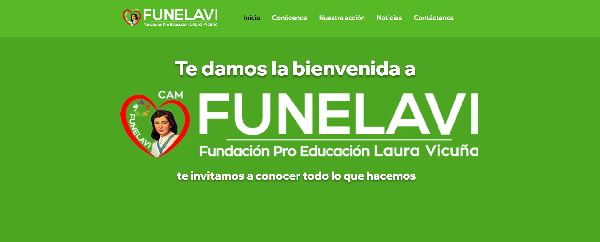
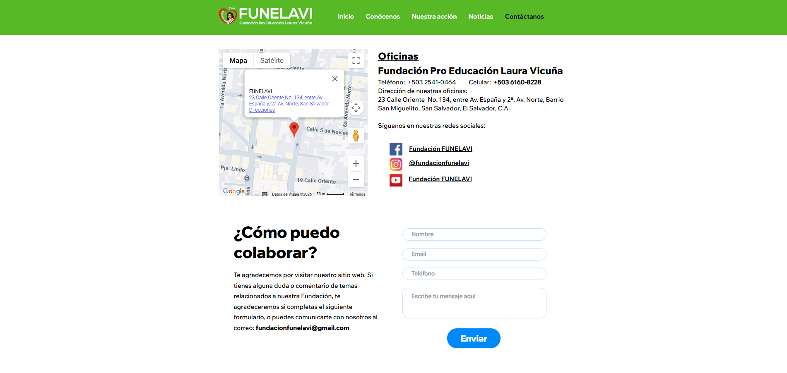
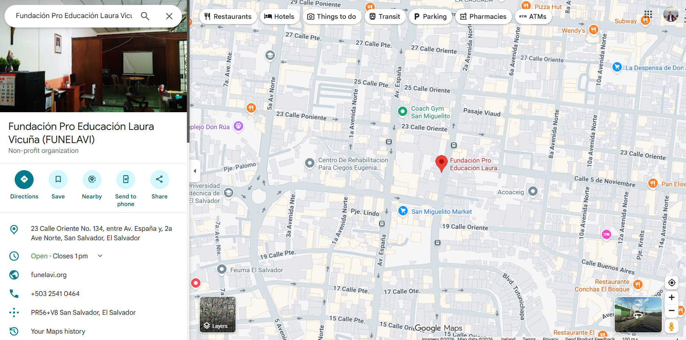
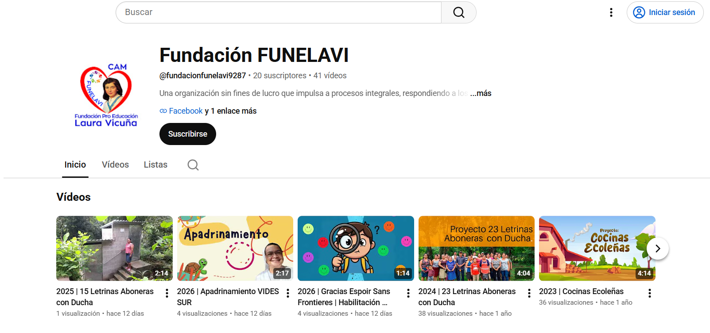

# Funelavi Web Design

In a remote capacity, I was responsible for designing the website with a responsive approach, editing photography and video content for the website and YouTube channel, supporting SEO efforts, and documenting public events. Since 2020, Funelavi has expanded into a digital space through its official website, helping increase the reach of projects developed in El Salvador, Honduras, and Guatemala. Through this work, the foundation continues supporting vulnerable groups in alignment with the UN Sustainable Development Goals.

Funelavi Web Design is a website design and maintenance project focused on improving the visual layout, usability, performance, and ongoing optimization of the website. It includes UI updates, content adjustments, responsiveness improvements, and regular maintenance tasks to keep the site fast, reliable, and user-friendly.

## Key Responsibilities

- Website design and visual updates.
- Ongoing website maintenance.
- Performance and speed optimization.
- Responsive layout improvements.
- Content and structure updates.
- General user experience enhancement.
- Monitoring and fixing layout or usability issues.
- Producing audiovisual content when needed.

## Project Goals

- Improve the overall look and feel of the website.
- Ensure the website works well across different devices and regions.
- Keep the site updated, stable, and easy to navigate.
- Optimize performance and user experience.
- Support long-term website maintenance and improvements.

## Tools Used

- Adobe Photoshop for image editing and visual assets.
- Wix as the website hosting platform and for hosting photos.
- Wondershare Filmora for editing some videos.
- YouTube for video hosting.
- Google Drive for hosting PDF files.

## Website Preview

## Google Business Profile Preview
https://maps.app.goo.gl/4JctcvUQJ39wrkkB9

## Youtube Channel Preview

